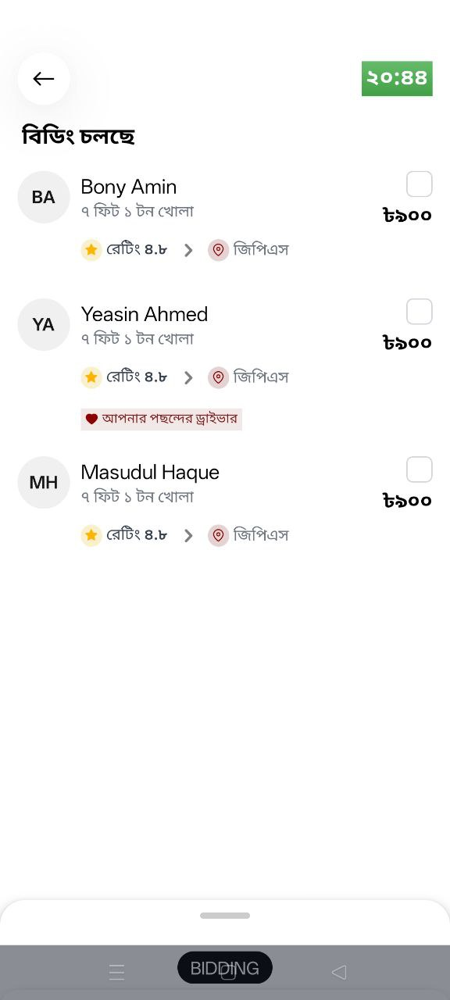
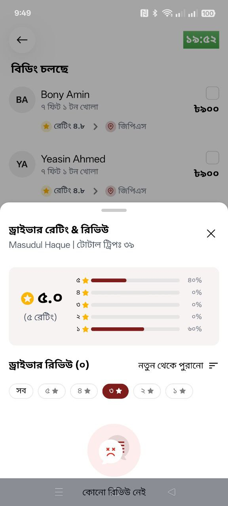

# TL-Shipper - Driver Rating & Review Panel

This project implements a fully interactive **Driver Rating & Review** experience built with **Expo (React Native)** and **TypeScript**, using **Gluestack UI**, **Nativewind**, and **Expo Router**.  

This project demonstrates advanced gesture-based interactions, sticky headers, and smooth draggable panels, closely following the provided design screens and flow video.

---

## Features

- **Draggable Panel**:
  - Supports three positions:
    - **Collapsed (COLLAPSED)**: Hidden view
    - **Mid (MID)**: Intermediate state for flexibility
    - **Expanded (EXPANDED)**: Full-screen
  - Panel can be dragged freely between all states
  - Smooth snapping with `Animated.spring`
  - Scroll enabled only in full-screen (expanded) mode

- **Full-Screen Expansion**:
  - Panel expands naturally while preserving the rating card scroll
  - Collapsed panel shows a partial view
  - Spring animation ensures responsive, natural motion

- **Sticky Header**:
  - Top section (rating card + driver info) scrolls internally
  - Header + sort/filter remain sticky using `stickyHeaderIndices`
  - Dynamic border appears on scroll for visual separation

- **Review List**:
  - Handles loading and empty states
  - Each review displays:
    - Star rating
    - Review text
    - Date / tags
  - Memoized sorting and filtering for performance

---

## Get started

1. **Clone the repository**
   
   ```bash
   git clone https://github.com/afiatamanna06/tl-shipper
   cd tl-shipper
   ```

2. Install dependencies

   ```bash
   npm install
   ```

3. Start the app (run on iOS / Android / Web)

   ```bash
    npx expo start
   ```
   Scan the QR code with Expo Go or launch an emulator.

   In the output, you'll find options to open the app in a

      - [development build](https://docs.expo.dev/develop/development-builds/introduction/)
      - [Android emulator](https://docs.expo.dev/workflow/android-studio-emulator/)
      - [iOS simulator](https://docs.expo.dev/workflow/ios-simulator/)
      - [Expo Go](https://expo.dev/go), a limited sandbox for trying out app development with Expo 

5. Run specific platform:

   ```bash
   npm run android   # Android
   npm run ios       # iOS
   npm run web
   ```     


---

## Tech Stack

- React Native 0.81

- TypeScript 5.9

- Gluestack UI for component styling and layout

- Nativewind / TailwindCSS for utility-first styling

- Expo Router for file-based routing

- React Native Gesture Handler & Reanimated for smooth gestures & panel animations

- Vector Icons / Lucide Icons for icons

---

## Technical Choices

- Gluestack UI + Nativewind: Consistent, reusable, and responsive components

- Animated API + PanResponder: Smooth, gesture-driven draggable panel

- Sticky Header using stickyHeaderIndices: Rating info, sort, and filter stay visible

- Memoization (useMemo) for reviews: Efficient sorting and filtering

- Scroll control via refs and scrollEnabled: Prevent conflicts between dragging and scroll

---

## Screenshots / Recording

### ScreenShots
Home Screen 

<p>
   
</p>

Review Panel

<p>
   
   
</p>

After Expansion

<p>
   
   
   
   
   
</p>

### Recording

<p>
   
</p>

---

## Evaluation Notes

- **Architecture:** Modular components (ReviewPanel, ReviewList, FilterPills, SortDropdown)

- **UI Accuracy:** Matches design screens and flow video

- **Interaction Smoothness:** Draggable panel snaps naturally; scroll is smooth

- **Code Quality & Readability:** TypeScript + Gluestack UI + Nativewind; clean and maintainable

- **Scalability:** Components reusable; review list handles dynamic data efficiently

- **Documentation:** Clear explanation of architecture, gestures, sticky header, and loading/empty states

---

## APK

- Android APK built with Expo: [link-to-apk]

- Testable directly on Android devices

---

## Contact

For questions or suggestions, please contact **Afia Anjum Tamanna**:

- Email: [afiatamanna06@gmail.com](mailto:afiatamanna06@gmail.com)  
- GitHub: [https://github.com/afiatamanna06](https://github.com/afiatamanna06)  
